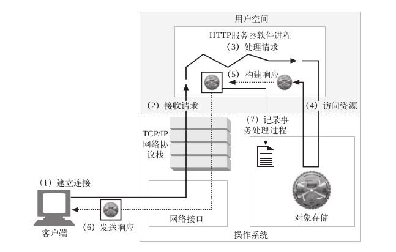

# Web 工作方式

这里，我们将主要讨论Web服务器的工作方式，Web 服务器会对 HTTP 请求进行处理并提供响应。实际的Web服务器主要会做以下这些任务：

1. **建立连接** 接受一个客户端连接，或者如果不希望与这个客户端连接则将其关闭。
2. **接收请求** 从网络中读取一条 HTTP 请求报文。
3. **处理请求** 对请求报文进行解释，并采取行动。
4. **访问资源** 访问报文中指定的资源。
5. **构建响应** 创建带有正确首部的 HTTP 响应报文。
6. **发送响应** 将响应回头给客户端。
7. **记录事务处理过程** 将与已完成事务有关的内容记录在一个日志文件中。

